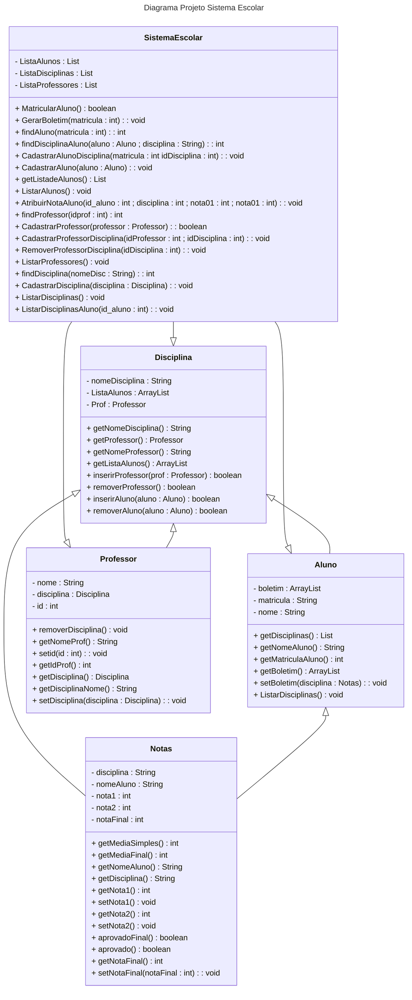

```mermaid
---
title: Diagrama Projeto Sistema Escolar 
---
classDiagram
    SistemaEscolar --|> Aluno
    SistemaEscolar --|> Disciplina
    SistemaEscolar --|> Professor
    Disciplina <|-- Professor
    Disciplina <|-- Aluno
    Disciplina <|-- Notas
    Aluno <|-- Notas


    class SistemaEscolar{
         - ListaAlunos : List<Aluno>
         - ListaDisciplinas : List<Disciplina>
         - ListaProfessores : List<Professor>
         + MatricularAluno() boolean
         + GerarBoletim(matricula : int) : void
         + findAluno(matricula : int) : int
         + findDisciplinaAluno(aluno : Aluno ; disciplina : String) : int
         + CadastrarAlunoDisciplina(matricula : int idDisciplina : int) : void
         + CadastrarAluno(aluno : Aluno) : void
         + getListadeAlunos() List<Aluno>
         + ListarAlunos() void
         + AtribuirNotaAluno(id_aluno : int ; disciplina : int ; nota01 : int ; nota01 : int) : void
         + findProfessor(idprof : int) int
         + CadastrarProfessor(professor : Professor) : boolean
         + CadastrarProfessorDisciplina(idProfessor : int ; idDisciplina : int) : void
         + RemoverProfessorDisciplina (idDisciplina : int) : void
         + ListarProfessores() void
         + findDisciplina(nomeDisc : String) : int
         + CadastrarDisciplina (disciplina : Disciplina) : void
         + ListarDisciplinas() void
         + ListarDisciplinasAluno(id_aluno : int) : void
    }
    class Aluno{
        - boletim : ArrayList<Notas>
        - matricula : String
        - nome : String
        + getDisciplinas() List<Disciplina>
        + getNomeAluno() String
        + getMatriculaAluno() int
        + getBoletim() ArrayList<Notas>
        + setBoletim(disciplina : Notas) : void
        + ListarDisciplinas() void
        
    }
    class Disciplina{
        - nomeDisciplina : String
        - ListaAlunos : ArrayList<Aluno>
        - Prof : Professor
        + getNomeDisciplina()  String
        + getProfessor()  Professor
        + getNomeProfessor() String
        + getListaAlunos() ArrayList<Aluno>
        + inserirProfessor(prof : Professor) boolean
        + removerProfessor() boolean
        + inserirAluno(aluno : Aluno) boolean
        + removerAluno(aluno : Aluno) boolean
    }
    class Professor{
        - nome : String
        - disciplina : Disciplina
        - id : int
        + removerDisciplina() void
        + getNomeProf() String
        + setid(id : int) : void
        + getIdProf() int
        + getDisciplina() Disciplina
        + getDisciplinaNome() String
        + setDisciplina(disciplina : Disciplina) : void

    }

    class Notas{
        - disciplina : String
        - nomeAluno : String
        - nota1 : int
        - nota2 : int
        - notaFinal : int
        + getMediaSimples() int
        + getMediaFinal() int
        + getNomeAluno() String
        + getDisciplina() String
        + getNota1()  int
        + setNota1()  void
        + getNota2()  int
        + setNota2()  void
        + aprovadoFinal() boolean
        + aprovado() boolean
        + getNotaFinal()  int
        + setNotaFinal(notaFinal : int) : void
    }

```