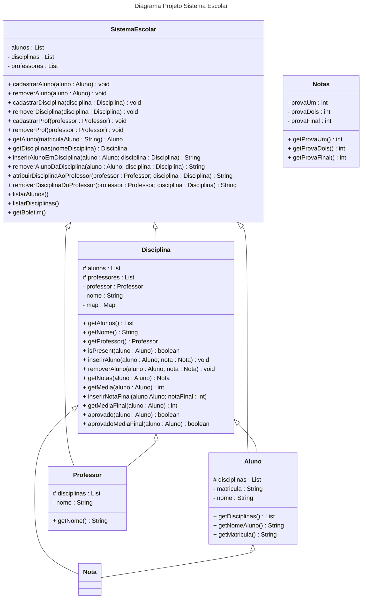

```mermaid
---
title: Diagrama Projeto Sistema Escolar
---
classDiagram
    SistemaEscolar <|-- Aluno
    SistemaEscolar <|-- Disciplina
    SistemaEscolar <|-- Professor
    Disciplina <|-- Professor
    Disciplina <|-- Aluno
    Disciplina <|-- Nota
    Aluno <|-- Nota


    class SistemaEscolar{
         - alunos : List<Aluno>
         - disciplinas : List<Disciplina>
         - professores : List<Professor>
         + cadastrarAluno(aluno : Aluno) void
         + removerAluno(aluno : Aluno) void
         + cadastrarDisciplina(disciplina : Disciplina) void
         + removerDisciplina(disciplina : Disciplina) void
         + cadastrarProf(professor : Professor) void
         + removerProf(professor : Professor) void
         + getAluno(matriculaAluno : String) Aluno
         + getDisciplinas(nomeDisciplina) Disciplina
         + inserirAlunoEmDisciplina(aluno : Aluno; disciplina : Disciplina) String
         + removerAlunoDaDisciplina(aluno : Aluno; disciplina : Disciplina) String
         + atribuirDisciplinaAoProfessor(professor : Professor; disciplina : Disciplina) String
         + removerDisciplinaDoProfessor(professor : Professor; disciplina : Disciplina) String
         + listarAlunos()
         + listarDisciplinas()
         + getBoletim()
    }
    class Aluno{
        # disciplinas : List<Disciplina>
        - matricula : String
        - nome : String
        + getDisciplinas() List<Disciplina>
        + getNomeAluno() String
        + getMatricula() String
        
    }
    class Disciplina{
        # alunos : List<Aluno>
        # professores : List<Professor>
        - professor : Professor
        - nome : String
        - map : Map<Aluno, Nota>
        + getAlunos() List<Aluno>
        + getNome()  String
        + getProfessor()  Professor
        + isPresent(aluno : Aluno)  boolean
        + inserirAluno(aluno : Aluno; nota : Nota)  void
        + removerAluno(aluno : Aluno; nota : Nota)  void
        + getNotas(aluno : Aluno)  Nota
        + getMedia(aluno : Aluno)  int
        + inserirNotaFinal(aluno  Aluno; notaFinal : int)
        + getMediaFinal(aluno : Aluno)  int
        + aprovado(aluno : Aluno)  boolean
        + aprovadoMediaFinal(aluno : Aluno)  boolean
    }
    class Professor{
        # disciplinas : List<Disciplina>
        - nome : String
        + getNome()  String
    }

    class Notas{
        - provaUm : int
        - provaDois : int
        - provaFinal : int
        + getProvaUm()  int
        + getProvaDois()  int
        + getProvaFinal()  int
    }

```