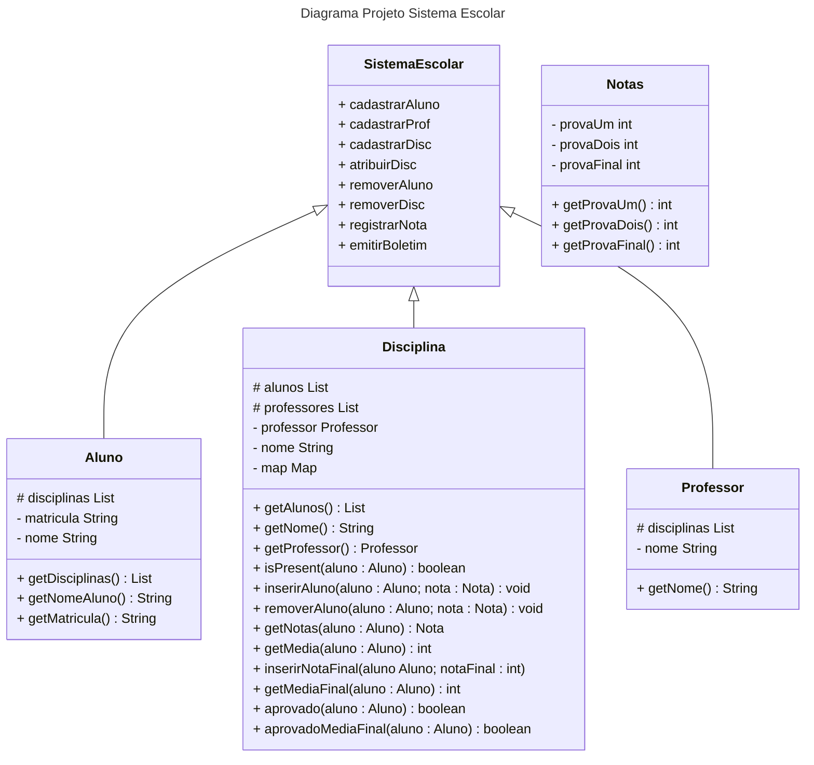

```mermaid
---
title: Diagrama Projeto Sistema Escolar
---
classDiagram
    SistemaEscolar <|-- Aluno
    SistemaEscolar <|-- Disciplina
    SistemaEscolar <|-- Professor
    SistemaEscolar : + cadastrarAluno
    SistemaEscolar : + cadastrarProf
    SistemaEscolar : + cadastrarDisc
    SistemaEscolar : + atribuirDisc
    SistemaEscolar : + removerAluno
    SistemaEscolar:  + removerDisc
    SistemaEscolar:  + registrarNota
    SistemaEscolar:  + emitirBoletim
    class Aluno{
        # disciplinas  List<Disciplina>
        - matricula  String
        - nome  String
        + getDisciplinas() List<Disciplina>
        + getNomeAluno() String
        + getMatricula() String
        
    }
    class Disciplina{
        # alunos  List<Aluno>
        # professores  List<Professor>
        - professor  Professor
        - nome  String
        - map  Map<Aluno, Nota>
        + getAlunos() List<Aluno>
        + getNome()  String
        + getProfessor()  Professor
        + isPresent(aluno : Aluno)  boolean
        + inserirAluno(aluno : Aluno; nota : Nota)  void
        + removerAluno(aluno : Aluno; nota : Nota)  void
        + getNotas(aluno : Aluno)  Nota
        + getMedia(aluno : Aluno)  int
        + inserirNotaFinal(aluno  Aluno; notaFinal : int)
        + getMediaFinal(aluno : Aluno)  int
        + aprovado(aluno : Aluno)  boolean
        + aprovadoMediaFinal(aluno : Aluno)  boolean
    }
    class Professor{
        # disciplinas  List<Disciplina>
        - nome  String
        + getNome()  String
    }

    class Notas{
        - provaUm  int
        - provaDois  int
        - provaFinal int
        + getProvaUm()  int
        + getProvaDois()  int
        + getProvaFinal()  int
    }

```