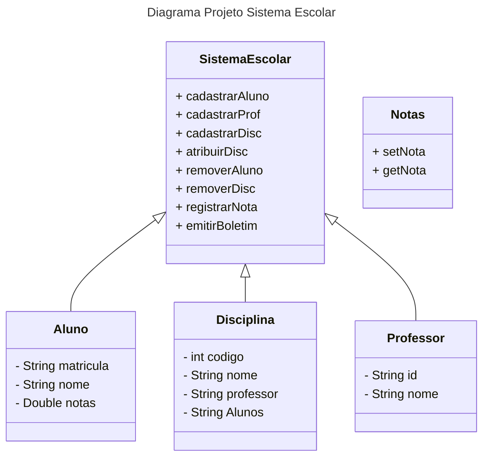

```mermaid
---
title: Diagrama Projeto Sistema Escolar
---
classDiagram
    SistemaEscolar <|-- Aluno
    SistemaEscolar <|-- Disciplina
    SistemaEscolar <|-- Professor
    SistemaEscolar : + cadastrarAluno
    SistemaEscolar : + cadastrarProf
    SistemaEscolar : + cadastrarDisc
    SistemaEscolar : + atribuirDisc
    SistemaEscolar : + removerAluno
    SistemaEscolar:  + removerDisc
    SistemaEscolar:  + registrarNota
    SistemaEscolar:  + emitirBoletim
    class Aluno{
        - String matricula
        - String nome
        - Double notas
    }
    class Disciplina{
        - int codigo
        - String nome
        - String professor
        - String Alunos
    }
    class Professor{
        - String id
        - String nome
    }

    class Notas{
        + setNota
        + getNota
    }

```